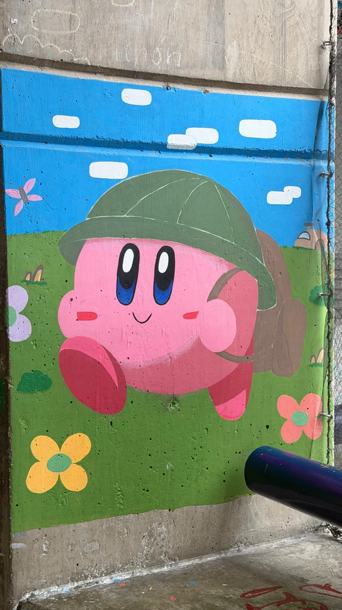

¿Como te sientes respecto a tu ritmo y adaptacion en CC?
Me he sentido inspirado y emocionado esta primera semana y media. Me encontre con algo completamente distinto a lo que esperaba, en un buen sentido, tanto por mis compañeros como por mis profesores. El sistema de ayudantes/profesores es cuioso, pero me parece sumamente funcional. Conforme a mi, me he sentido lo suficientemente prepardo, aun hay cosas que tengo que estuidar y otras que ya domino, pero he sabido adaptarme de manera eficiente a los distintos retos que se nos han planteado durante este poco tiempo.

